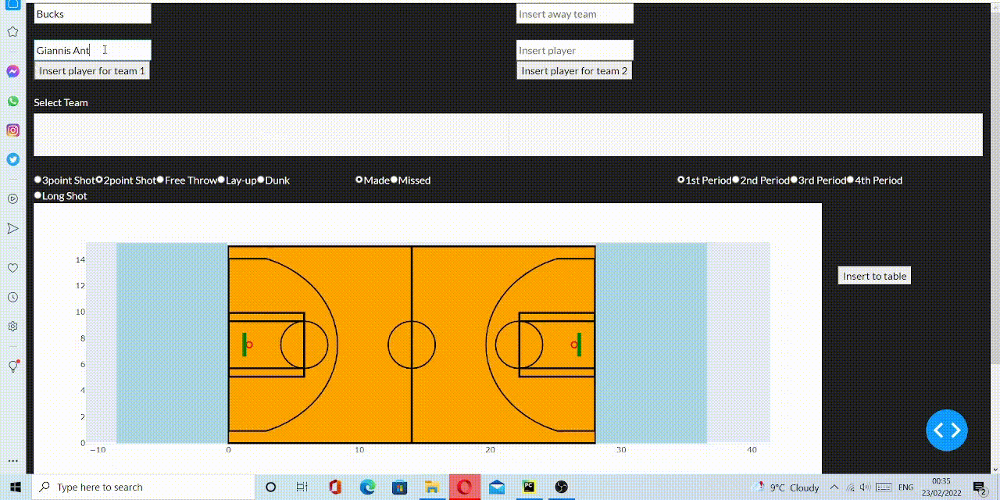
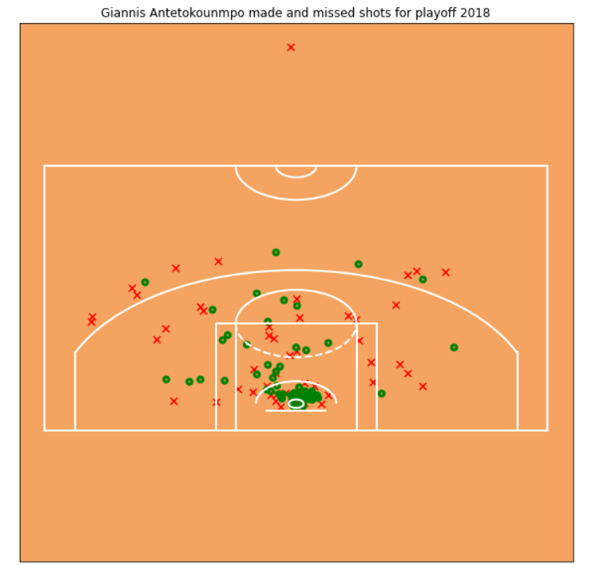
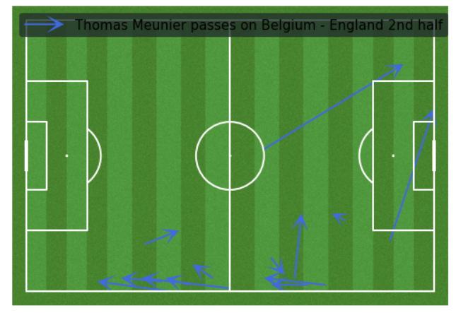
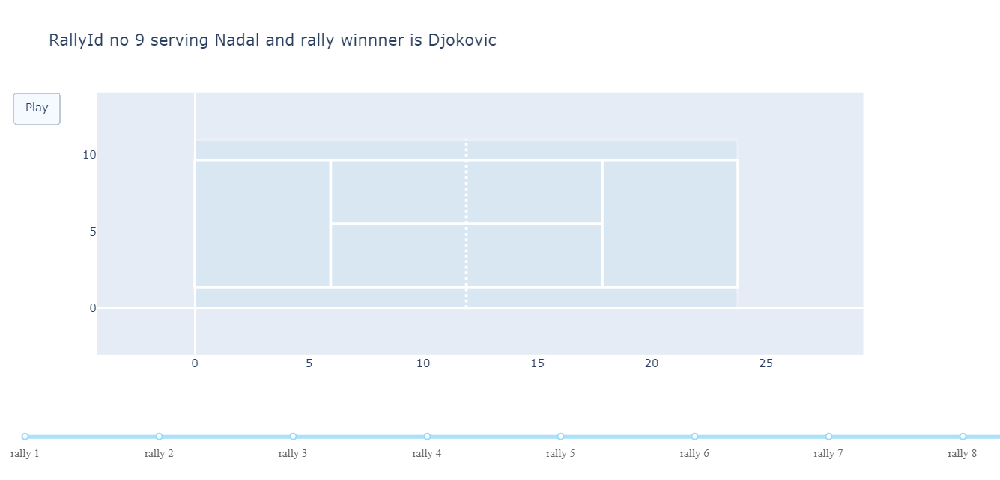
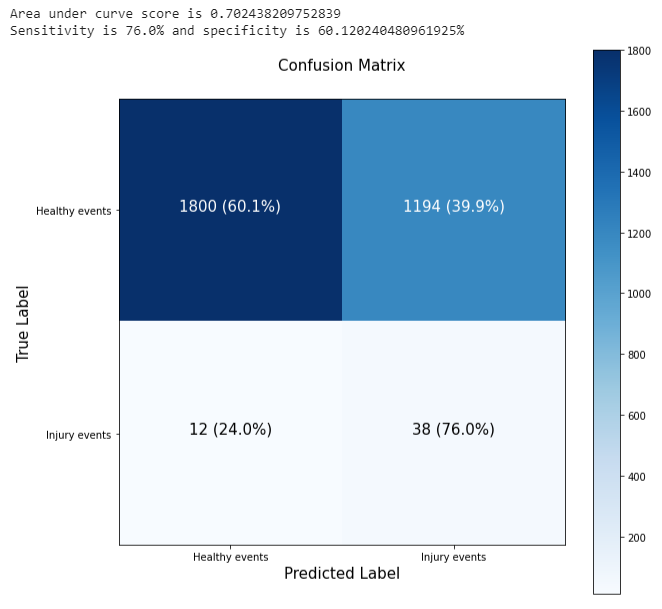
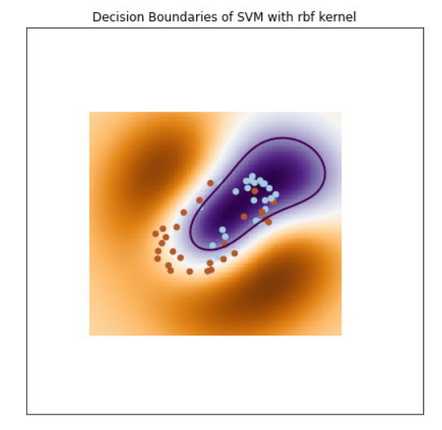
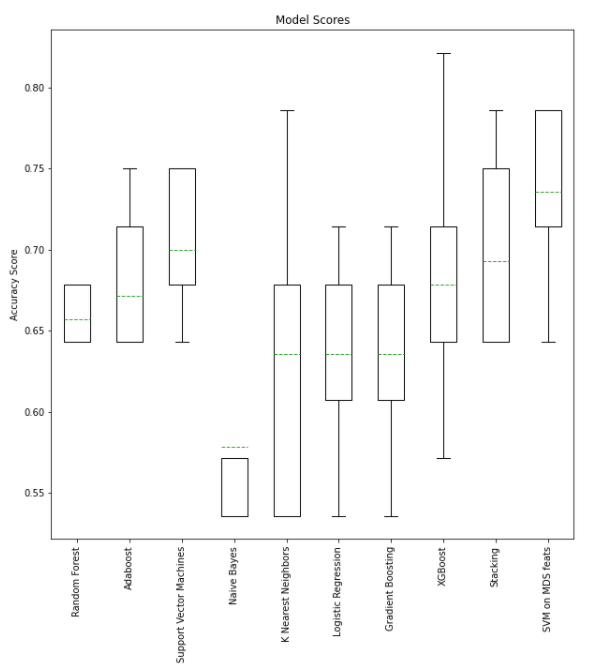
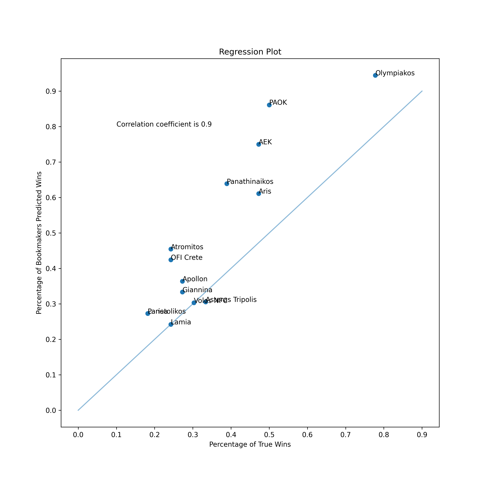

# Spyros Vizirgianakis

Junior Data Engineer

# *About*
Hello, my name is Spyros Vizirgianakis. I was born in 1993 and I come from Crete, a beautiful island in Greece. My bachelor degree is in Physiotherapy, however after completing my master thesis, I was fascinated by data and statistics. Thus I decided to learn python, SQL, data science and machine learning frameworks and pursue a career in data science and analytics. I believe data science can transform industries and solve many real world problems.
# *My Projects*
## **1. Web dashboard for extracting basketball player coordinates during match events(3point shot,dunk etc...)**

### Project Description
This project was created in order to be able to extract player coordinates data on basketball court during match events. The user has the ability to insert home team and away team and add players for each team. Then he can choose team,player,event(3pt shot,2pt shot,free throw,lay-up,dunk,long shot),period and if the event was successful or not (made or missed). After that he can left click on the basketball court graph the position of that player when the selected event happened. Coordinates x and y as well as distance from hoop are displayed and then he can add all these inputs as a row in a table via clicking a button. In the end, the table can also be downloaded in excel format. The app can be found here [https://extract-basketball-coordinates-data-app.onrender.com](https://extract-basketball-coordinates-data-app.onrender.com)
### Programming Language and Frameworks used
Python, Dash
### Some of the python libraries used
Pandas, Plotly, Dash, Numpy

## **2. Sports Event Visualization**

### Project Description
This project contains 3 main parts regarding football, basketball and tennis. Data were found on kaggle, figshare and statsbomb python API (more details in relevant github repository). In football, I visualized a Belgium's player passes on football court, in the second half of a FIFA World Cup 2018 match between Germany and Belgium. In basketball part, I visualized Giannis Antetokounmpo's xy coordinates on basketball court for his made and missed shots, in NBA Playoffs 2018. In tennis part, Australian Open Final 2019 players coordinates (Nadal-Djokovic) were visualized when winning after creating a function to plot a tennis court with it's dimensions in meters. In addition, a simple web app animation was created to select a specific rally of the game and animate it, based on players coordinates on tennis court. The web app can be found [here](https://spyrosviz.eu.pythonanywhere.com).
### Project's main result

### Programming Language and Frameworks used
Python, Google Colab, Dash, pythonanywhere
### Some of the python libraries used
Pandas, Plotly, Dash, Mplsoccer, Statsbombpy

## **3. Injury Prediction on Mid-Long Distance Runners**

### Project Description
The aim of this project was to predict overused injuries in mid-long distance runners before they happen based on a number of features regarding external load, subjective estimates of exertion etc. Each instance (healthy day or injury day) contains variables containing information about the previous 7 days before that instance. Target variable (injury or not) was heavily imbalanced. Data were found on a github repository of [josedv82](https://github.com/josedv82/public_sport_science_datasets), containing open source datasets relative to sports science. More information can be found on the original source [https://dataverse.nl/dataset.xhtml?persistentId=doi:10.34894/UWU9PV](https://dataverse.nl/dataset.xhtml?persistentId=doi:10.34894/UWU9PV).
### Project's main result
Best model resulted in 70% Area Under Curve Score, 76% Sensitivity and 60% Specificity
### Programming Language used
Python, Google Colab
### Some of the python frameworks used
Numpy, Pandas, Sklearn, Imbalanced, Tensorflow

## **4. Elder Fallers Prediction**

### Project Description
Classification of elder fallers who have self reported falls during last year versus healthy elders who have not fallen. Predictors are some clinical questionnaires and tests as well as some new features constructed with accelerometer data from 1 minute self paced walking. Dataset consists of 71 subjects and was found on Long Term Movement Monitoring Database in physionet.org.
### Project's main result
78% mean accuracy score on 5fold crossvalidation 
### Programming Language used
Python, Google Colab
### Some of the python libraries used
Numpy, Pandas, Matplotplib, Sklearn

## **5. Parkinson Classification**

### Project Description
Classification of Parkinson from healthy individuals based on features constructed from acceleration data, extracted during 2 minutes of self paced walking. Some of the new features constructed are Hurst exponent from detrended fluctuation analysis and sample entropy on stride time intervals. Limitations on using these features in the current project are mentioned in the Read.me file in github repository. Dataset consists of 93 and 73 parkinson and healthy subjects respectively, and was found on Gait in Parkinson's Disease database at physionet.org.
### Project's main result
73% mean accuracy score on 5fold crossvalidation
### Programming Language used
Python, Google Colab
### Some of the python libraries used
Numpy, Pandas, Seaborn, Sklearn

## **6. Greek Football League Analysis 2020-2021**

### Project Description
The aim of this project was to find bookmaker's accuracy and provide useful insights from statistics of the whole league as well as per individual team. Data were found on football-data.uk.com.
### Project's main results
Bookmaker predicted 82.4% of home wins right, 48.1% of away wins right and just 1.4% of draws right. The three most important match statistics, associated with win in the league were total number of shots on target, total number of shots and number of fouls.
### Programming Language used
Python, Google Colab
### Some of the python libraries used
Numpy, Pandas, Matplotlib, Sklearn

# *Education*
* Bachelor in Physiotherapy, Alexander Technological Educational Institute of Thessaloniki
* Master in Sport and Health, Aristotle University of Thessaloniki

# *Scientific Publications*
Vizirgianakis S, Amiridis IG, Mademli L, Tsiouri C, Hatzitaki V. [Posture dependent ankle and foot muscle responses evoked by Achilles' tendon vibration.](https://www.sciencedirect.com/science/article/abs/pii/S0304394021003736?via%3Dihub) Neurosci Lett. 2021 Aug 10;759:135995. doi: 10.1016/j.neulet.2021.135995. Epub 2021 May 28. PMID: 34058294.
